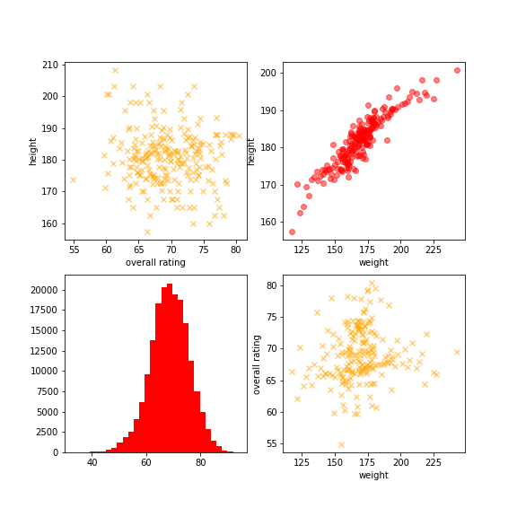

# European-Soccer-EDA

### Data

This dataset contains 25k+ matches, players & teams attributes for European Professional Football, including:

* +25,000 matches 
* +10,000 players 
* 11 European Countries with their lead championship 
* Seasons 2008 to 2016 
* Players and Teams' attributes* sourced from EA Sports' FIFA video game series, including the weekly updates 
* Team line up with squad formation (X, Y coordinates) 
* Betting odds from up to 10 providers 
* Detailed match events (goal types, possession, corner, cross, fouls, cards etc...) for +10,000 matches 

Source: Kaggle

https://www.kaggle.com/hugomathien/soccer

### Understanding the data

I begin my EDA by looking at my datasets and try to understand my datasets. My data contains a Country table and a League table. I combined the two table into one. 

Country|	League
----|---------
Belgium|Belgium Jupiler League
England|	England Premier League
France|France Ligue 1
Germany	|Germany 1. Bundesliga
Italy	|Italy Serie A
Netherlands|	Netherlands Eredivisie
Poland|	Poland Ekstraklasa
Portugal|	Portugal Liga ZON Sagres
Scotland|	Scotland Premier League
Spain	|Spain LIGA BBVA
Switzerland	|Switzerland Super League

The match table contains information of every match events from season 2008/2009 to 2015/2016. 

#### Teams
From the team attribute table, I'm able to look at the correlations between each features and plot the heatmap. The top stronge correlations are shown between the defence pressure and defence team width, defence pressure and defence aggression build up play passing and build up play speed. 

Therefore we may say that in order to form a strong defence, a team may wants to design a wider back field squad format.

#### Players
Same as the team table, I started to look at the players by plot the heatmap.

One interesting observation from this heatmap is, for a player, the height and weight shows a strong positve correlation with his strength,but shows negative correlations with most of his features such as balance, acceleration, agility, etc. I then plotted the distributions for the player's height and weight.

It seems like the two features are normal distributions. 

Does height and weight affect on a player's overall rating? Not obviously.

#### Matches
Base on the Match table, I computed the winning rates for each team. And I was curious on how the team attributes affect the winning rates.

Using the winning rate, I ranked the top ten and bottom ten teams:

**Top Ten Teams** 

Ranking | Team
--------|-----
1        |FC Barcelona
2      |Real Madrid CF
3       |   SL Benfica
4        |    FC Porto
5         |     Celtic
6          |   Rangers
7    |FC Bayern Munich
8     |           Ajax
9      |           PSV
10     | RSC Anderlecht

**Bottom Ten Teams**

Ranking | Team
--------|-----
296|     SpVgg Greuther Fürth
295|              Córdoba CF
294|         AC Arles-Avignon
293|    DSC Arminia Bielefeld
292|             FC Dordrecht
291|     Dunfermline Athletic
290|             ES Troyes AC
289|              FC Penafiel
288 |                 Pescara
287  |                Reading

### Hypothesis
As a non soccer fan, I always hear people say that home teams has advantages over away teams. I wonder if that's true for soccer. For each team, I obtained the winning rates when it played as home team and away time. 

Set my null hypothesis:

I used Welsh's T-test on home winning rates and away winnning rates. 

T-statistic|p-value
---------|---------
14.2052|1.832e-39

The p-value is small enough to reject the H0. 

$$\mu$$

